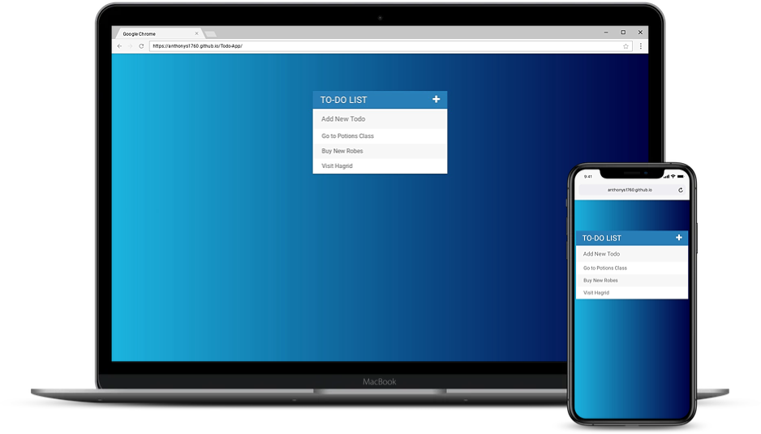

# Todo-App

View Live Site: https://anthonys1760.github.io/Todo-App/

This is a todo app that allows you to input to-do items for you to access at anytime. Once a task is completed you can simply select that item inside the app and it will cross that item off the list. You can also delete items as well using the trach icon. The languages used to create this app were HTML, CSS, JavaScript and jQuery.
